# MultiDeviceBoard

MultiDeviceBoard for mobile games, like Pokemon Go.

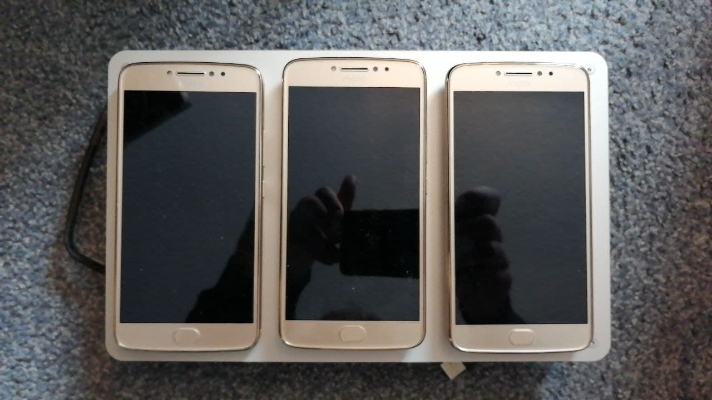

## Screenshots
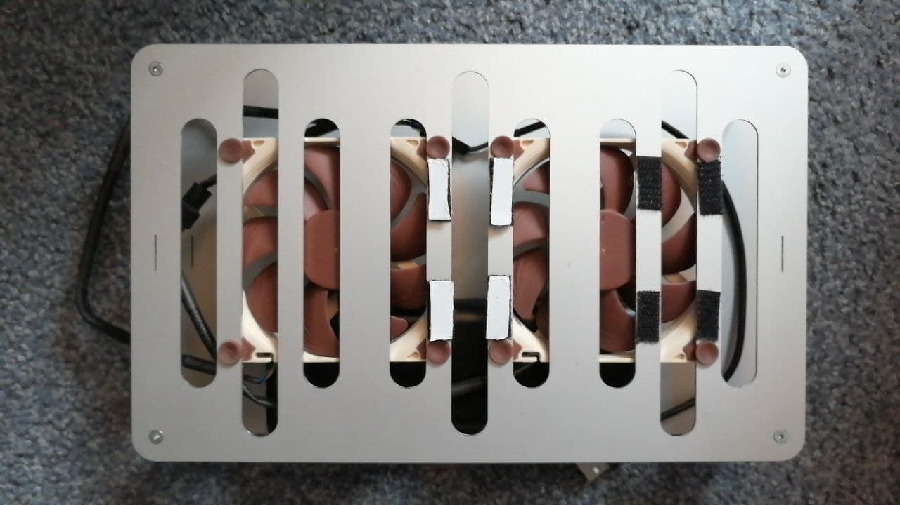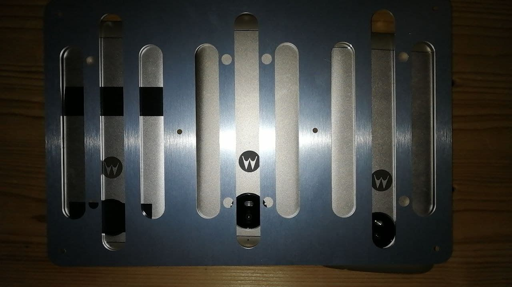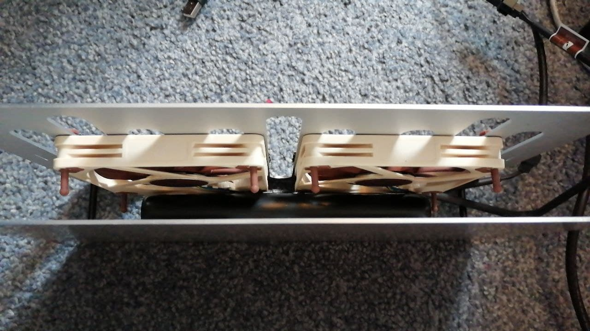

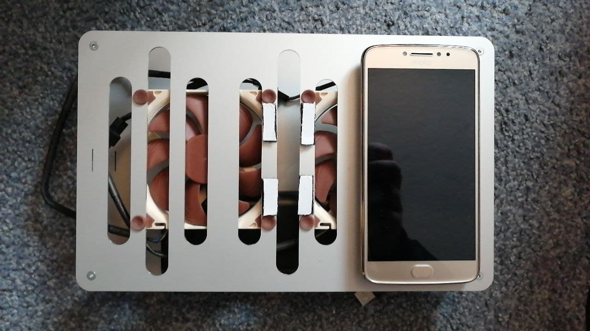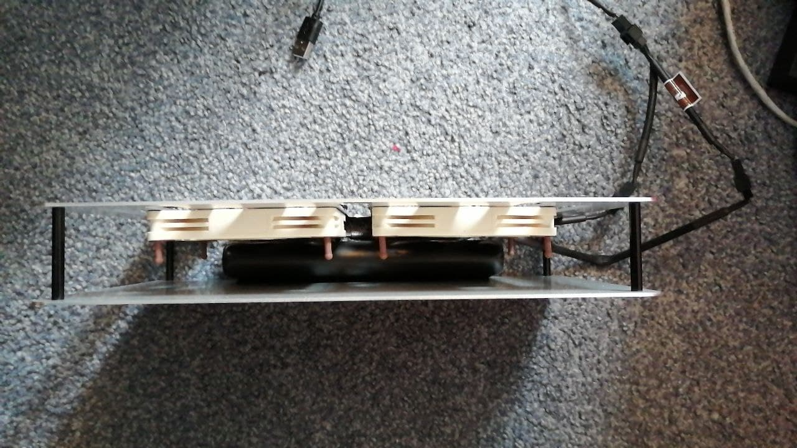

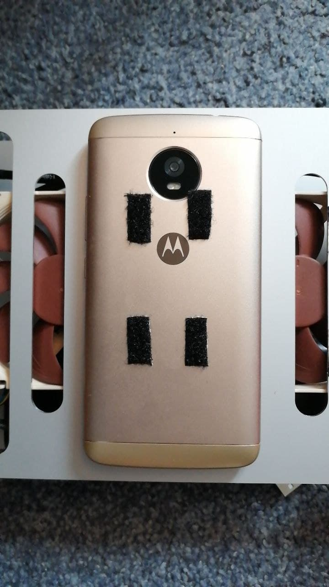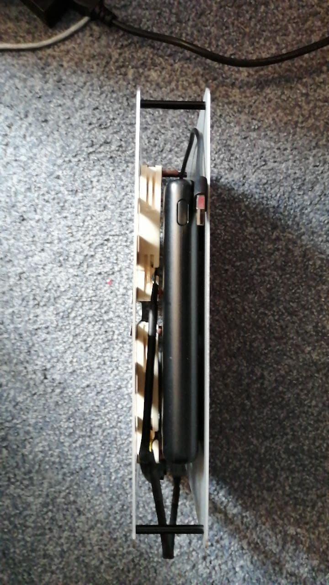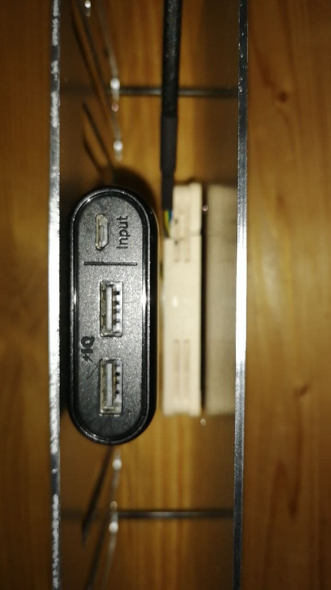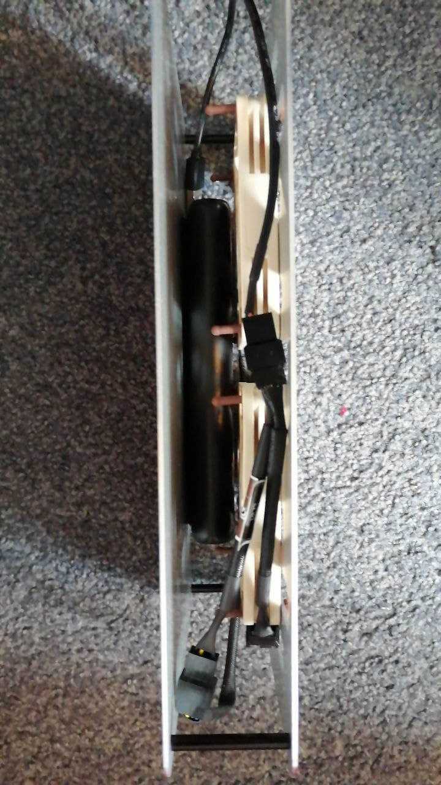

## Engineering Drawing

Found the dxf files inside data.

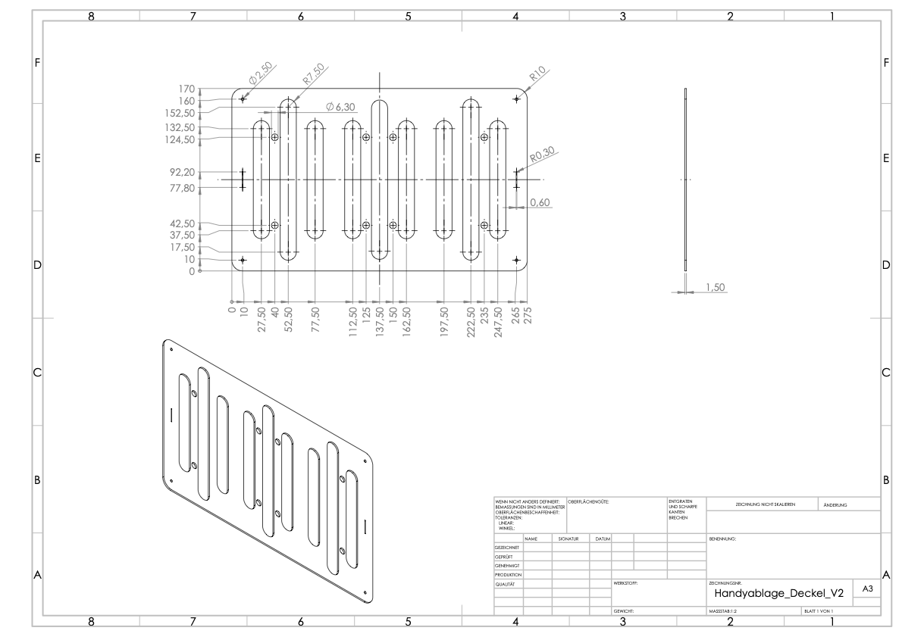

## Used Parts

- Screws: https://www.screwsandmore.de/de/sortiment/hochfeste-verbindungselemente/din-7991-stahl-10.9/din-7991-10.9-m3/din-7991-10.9-m3x6/14551/25-stueck-senkkopfschrauben-din-7991-hochfest-10.9-schwarz-m3x6
- Fans: https://www.reichelt.de/noctua-nf-a9x14-pwm-gehaeuseluefter-92-mm-no-nf-a9x14-pwm-p179667.html?&trstct=pos_0&nbc=1
- Fan adapter cable: https://www.amazon.de/gp/product/B07C4RZ4RF/ref=ppx_yo_dt_b_asin_title_o05_s00?ie=UTF8&psc=1
- Fan distributor cable: https://www.amazon.de/gp/product/B01LFCITM2/ref=ppx_yo_dt_b_asin_title_o04_s00?ie=UTF8&psc=1
- Spacer: https://de.aliexpress.com/item/1005001711924491.html?albpd=de1005001711924491
- Powerbank: https://www.amazon.de/dp/B00VJT3IUA/ref=cm_sw_em_r_mt_dp_7QRH7JRHY0761NAVM7EF?_encoding=UTF8&psc=1

## Known Issues

Fans will not auto mount, so you need to insert an upstepper or other fan models. Mount them by yourself will work.
